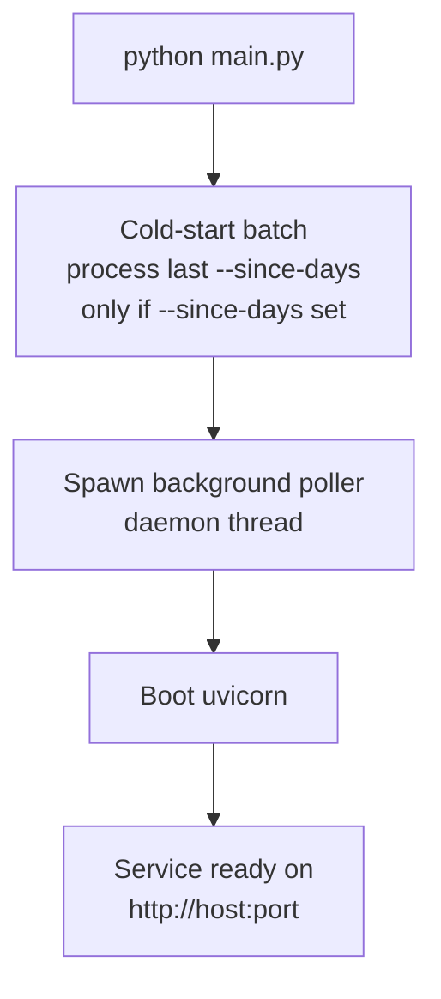
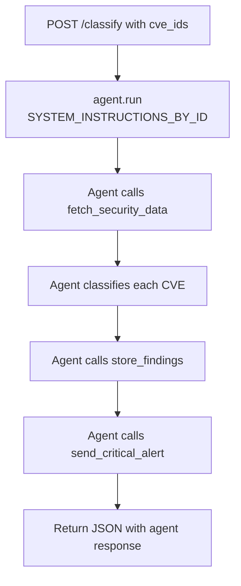
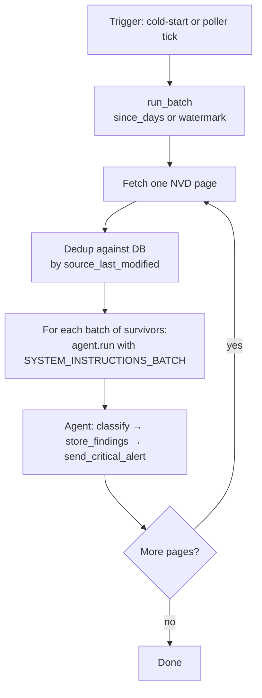
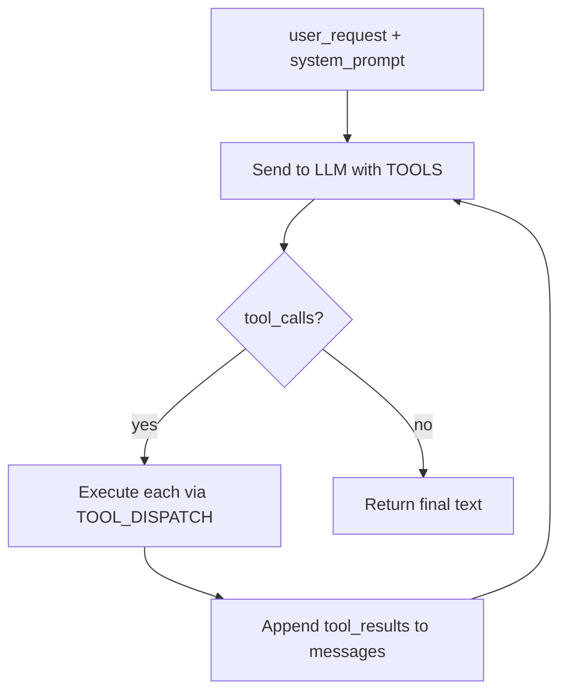

# Flows

Top-to-bottom flow charts for the main paths through the system. All
diagrams are [Mermaid](https://mermaid.js.org/) — they render natively on
GitHub and in modern Markdown viewers.

---

## Service startup

---

## On-demand triage — POST /classify

---

## Cold-start batch / periodic poll

Same flow, two triggers — the optional cold-start on service startup and
the background poller thread (every `--poll-interval` seconds).

---

## The agent loop

Same cycle for both flows — the only difference is which `system_prompt`
the caller passes.

